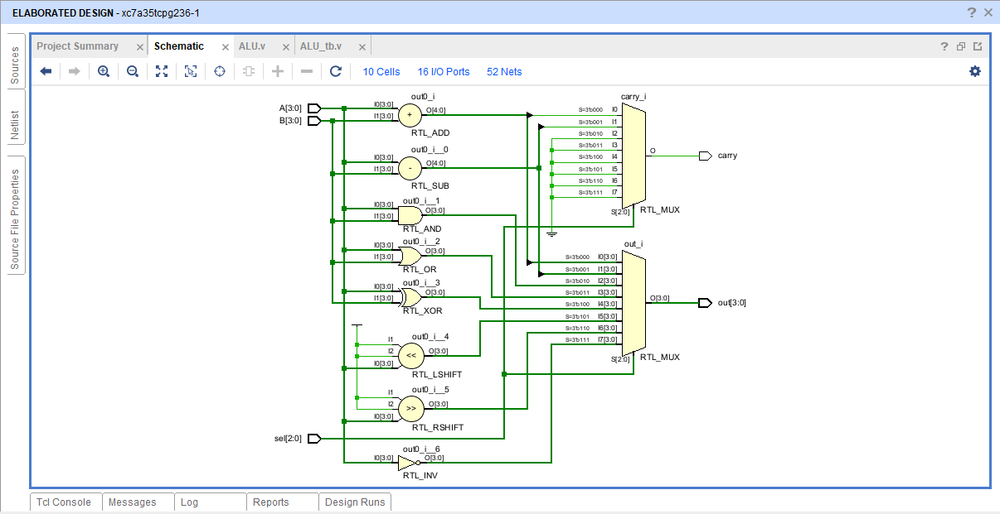
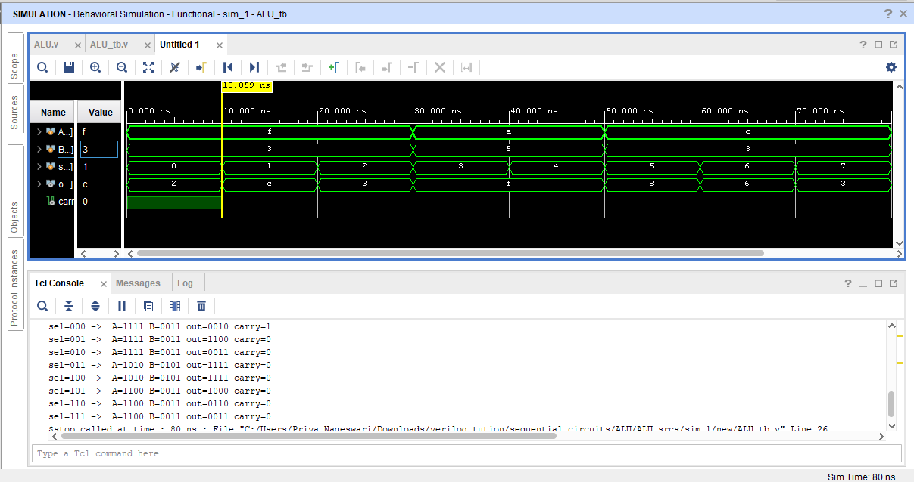
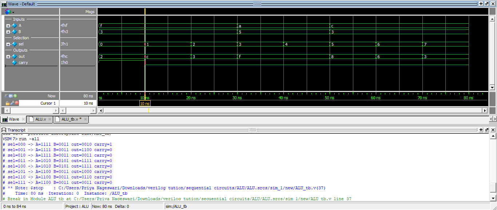

# 4-bit ALU Using Verilog HDL

## Overview

This project presents the design and simulation of a 4-bit Arithmetic Logic Unit (ALU) using Verilog HDL. The ALU is designed using combinational digital logic to perform arithmetic, logical, and shift operations based on selection inputs.

The design is modeled using Register Transfer Level (RTL) methodology and verified through simulation using Vivado and ModelSim.

---

## Features

- 4-bit ALU architecture
- Arithmetic operations
- Logical operations
- Shift operations
- Carry generation
- RTL-based combinational design
- Vivado RTL schematic generation
- Simulation and verification using Vivado and ModelSim

---

## Technologies Used

- Verilog HDL
- RTL Design
- Digital Logic Design
- Testbench Verification

---

## Project Files

- `ALU.v` – Main Verilog HDL design file
- `ALU_tb.v` – Testbench for simulation and verification
- `4_bit_ALU.pdf` – Project documentation report
- `ALU_schematic.png` – RTL schematic output
- `ALU_vivado_sim.png` – Vivado simulation waveform
- `ALU_Modelsim_sim.png` – ModelSim simulation waveform

---

## RTL Schematic

---

## Vivado Simulation Output

---

## ModelSim Simulation Output

---

## Verification

The functionality of the ALU was verified using a dedicated Verilog testbench in Vivado and ModelSim simulation environments. The simulation waveforms confirm correct execution of arithmetic, logical, and shift operations along with proper output generation and carry behavior.

---

## Future Scope

- FPGA implementation
- Parameterized ALU design
- Extended bit-width architecture
- Integration with processor datapath
- Advanced arithmetic operations
- Optimized RTL architecture

---

## Author

Priya Nageswari Karanam
